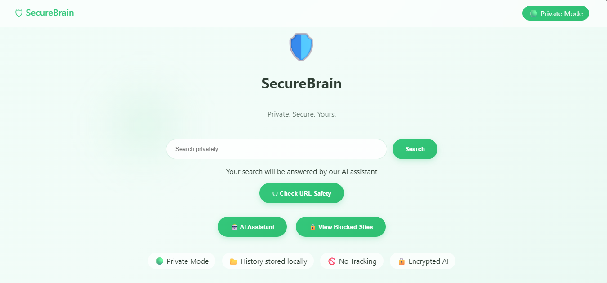
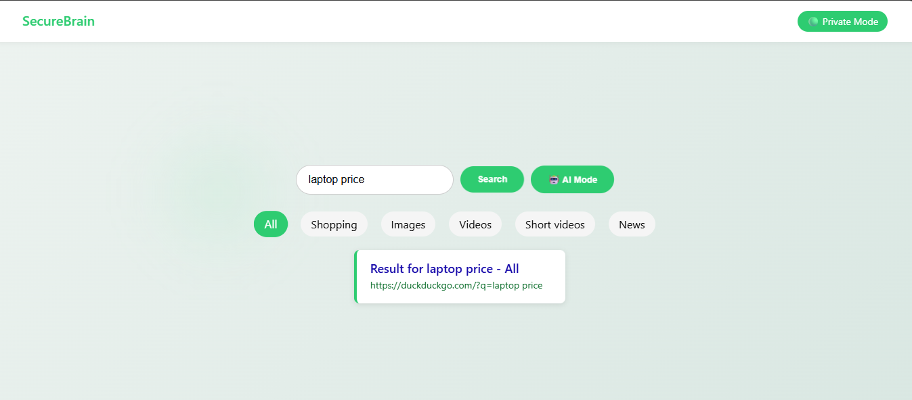
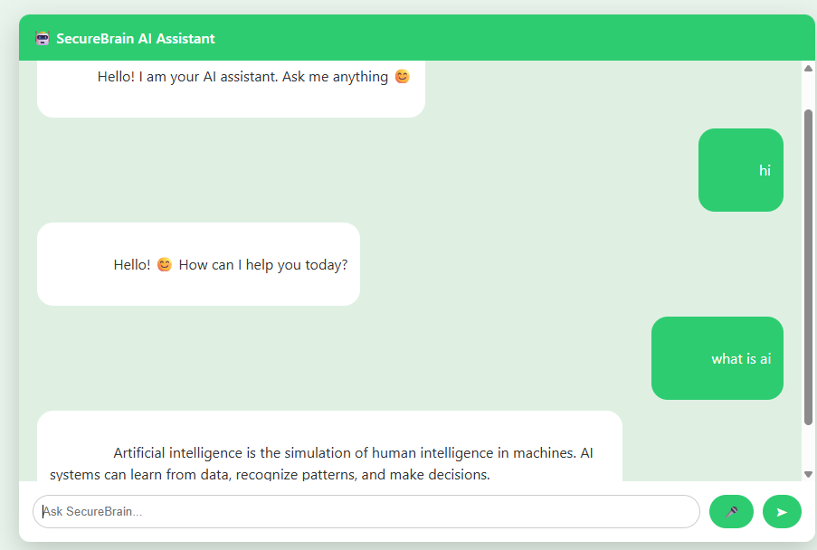
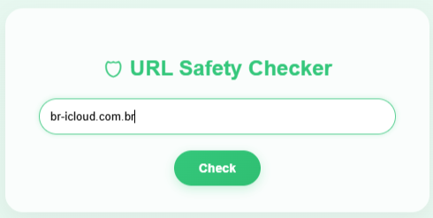
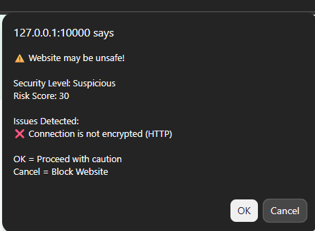
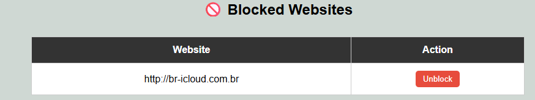

# 🧠 SecureBrain

SecureBrain is an AI-powered secure search engine and assistant that combines intelligent query answering with real-time phishing detection and safe browsing.

---

## 🚀 Features

### 🤖 AI Assistant
- Answers questions using:
  - Local knowledge base
  - Wikipedia API
  - Dictionary API
  - StackOverflow (for programming)
- Spell correction & smart query understanding
- Handles:
  - General questions
  - Programming queries
  - Math calculations

---

### 🔍 Secure Search Engine
- Smart query classification:
  - Questions → AI answers
  - Keywords → search results
- Fetches safe results using DuckDuckGo
- Provides:
  - Web results
  - Images
  - Videos
  - Shopping links

---

### 🛡️ URL Risk Detection
- Detects phishing & malicious websites using:
  - HTTPS check
  - IP-based URLs
  - Suspicious keywords
  - Domain length & structure
  - Blacklist matching

- Outputs:
  - Risk score
  - Security level (Safe / Suspicious / Dangerous)
  - Action (Allow / Warning / Block)

---

### 📊 Activity Logging
- Stores browsing data in SQLite database
- Tracks:
  - URL visited
  - Risk score
  - Status
  - Timestamp

---
## 🏗️ Project Structure

SecureBrain/
│
├── app.py # Main Flask app
├── ai_engine.py # AI chatbot logic
├── search_engine.py # Search system
├── risk_engine.py # URL security analysis
├── database.py # SQLite logging
├── knowledge_base.txt # Local AI knowledge
├── requirements.txt # Dependencies

## ⚙️ Installation

## 1. Clone the repo
bash
git clone https://github.com/your-username/SecureBrain.git
cd SecureBrain
2. Install dependencies
pip install -r requirements.txt
3. Run the app
python app.py

## 📸 Screenshots

 

 

 

 

 

 

